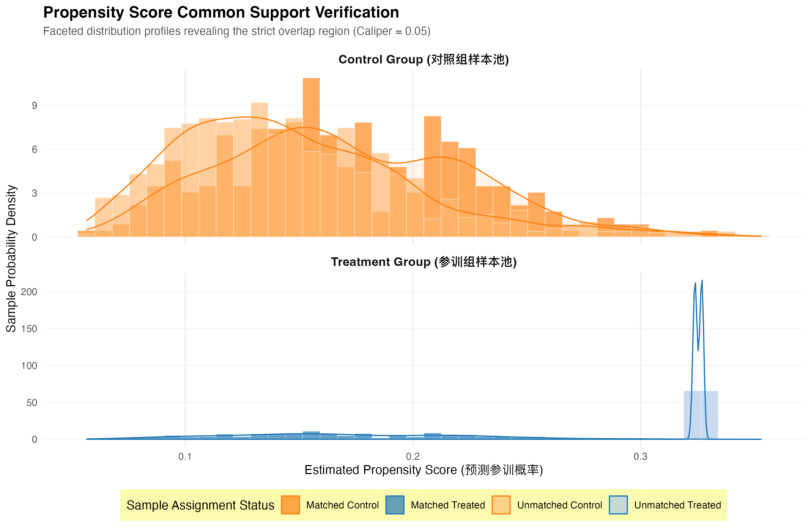
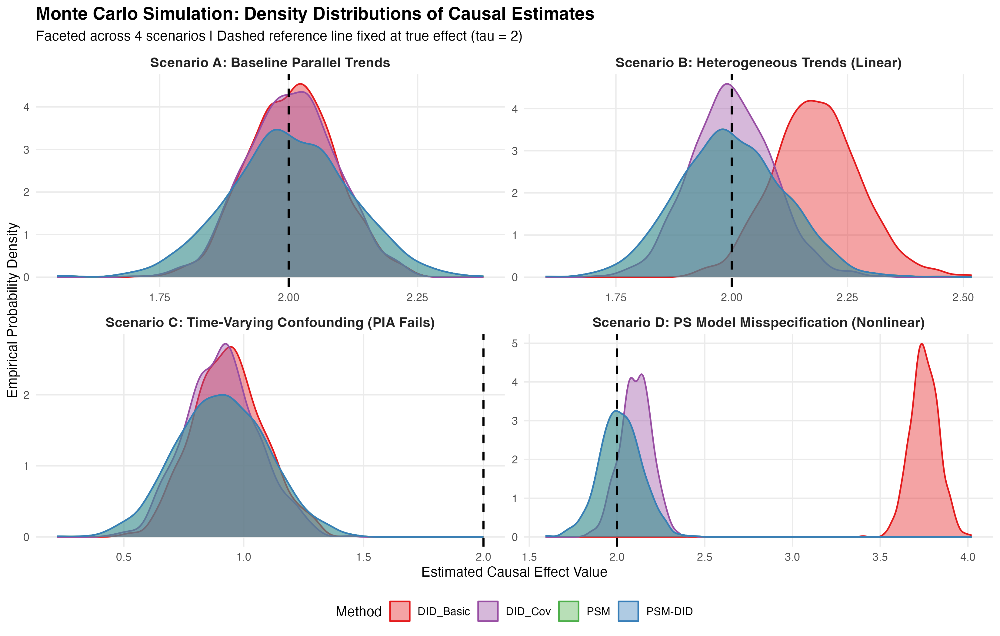

# 作业 1：用 Monte Carlo 模拟理解 PSM-DID 的识别逻辑与理论边界

## 一、 问题背景

### 1.1 因果推断的核心挑战
在社会科学与商业管理实证研究中，评估一项政策或干预的真实因果效应面临的核心挑战是“反事实缺失问题”。根据潜在结果框架，对于任何一个个体 $i$ ，其在 $t$ 时期存在两个潜在结果：接受干预后的潜在结果 $Y_{it}(1)$ 与未接受干预后的潜在结果 $Y_{it}(0)$ 。在现实世界中，我们只能观测到实际发生的结果 $Y_{it}$ ：

$$Y_{it} = D_i Y_{it}(1) + (1 - D_i) Y_{it}(0)$$

其中 $D_i \in \{0, 1\}$ 为二元干预状态变量。因此，观测数据中往往存在由于非随机分配导致的“自我选择偏差”，直接比较处理组与控制组的均值无法得到一致的因果估计。

### 1.2 传统因果推断方法的优势与局限
为了克服选择偏差，传统计量经济学发展出了双重差分法（DID）和倾向得分匹配法（PSM）：
* **双重差分法（DID）** 通过对面板数据进行双向差分，能够有效剔除个体层面不随时间变化的不可观测异质性（如个体天赋、企业文化等）。但传统 DID 极度依赖“无条件平行趋势假设”，即处理组与控制组在政策前后的自然演进轨迹必须完全一致。若两组在基线可观测特征上存在较大差异，且时间演进趋势与这些特征相关，传统DID将产生严重的识别失效。
* **倾向得分匹配法（PSM）** 遵循条件独立假设，通过多维可观测协变量将干预分配概率降维为一维的倾向得分，在共同支持区域内为处理组寻找相似的控制组。然而，传统的横截面PSM只能基于“可观测变量”进行匹配，一旦面临不可观测的个体固定效应，估计结果依然存在偏误。

### 1.3 PSM-DID的结合与研究问题
为了同时解决“基于可观测特征的趋势异质性”与“不可观测的个体固定效应”，学者将两者结合，提出了PSM-DID方法。其基本思想是：先利用处理前的多维协变量估计倾向得分，在共同支持区域内进行严苛匹配，消除两组在可观测特征上的分布差异，从而满足“条件平行趋势假设”；再在匹配后的高质量可比样本上执行双重差分回归，剔除不随时间变化的不可观测混淆变量。

为了清晰界定传统DID 、单独PSM 与PSM-DID在微观政策评估中的适用边界，本报告设定了一个经典的劳动经济学场景：评估政府资助的“就业培训项目”对失业/低收入劳动者未来真实年收入的因果效应。通过构建可控的Monte Carlo模拟环境，我们能够透视不同数据生成机制（DGP）下各估计量的偏误（Bias）与均方根误差（RMSE），从而为因果推断方法的选择提供坚实的数理与实证支撑。

## 二、 模拟设计

本模拟构建了一个包含2000个个体样本（ $N=2000$ ）、观测处理前（ $t=0$ ）和处理后（ $t=1$ ）两期的面板数据环境。为确保模拟结论的稳健性，每个场景均独立重复随机抽样模拟 1000次（ $\text{Iterations}=1000$ ）。设定真实的因果效应参数 $\tau = 2.0$ 。

### 2.1 基础协变量与多维劳动者画像
为了使模拟高度贴合真实的微观调查数据集（如 CPS），本设计排除了单一协变量的非现实设定，显式构造了三个维度的可观测个体特征，涵盖连续分布、均匀分布与二元分布：
1. **学历（ $X_{1i}$ ）**：受教育年限，服从均值为12（代表高中毕业水平）、标准差为2.5的正态分布： $X_{1i} \sim N(12, 2.5^2)$ 。
2. **年龄（ $X_{2i}$ ）**：劳动者年龄，服从22岁至55岁的均匀分布： $X_{2i} \sim U(22, 55)$ 。
3. **婚姻状况（ $X_{3i}$ ）**：二元变量，服从60%概率为已婚的二项分布： $X_{3i} \sim \text{Binomial}(1, 0.6)$ ，用以代理劳动者潜在的家庭养家动机与经济压力。
4. **个体未观测异质性（ $\alpha_i$ ）**：代表个体时间不变的内在工作动机或天赋，服从标准正态分布： $\alpha_i \sim N(0, 1)$ 。

基础可观测财富及收入方程（观测结果的基线部分）设定为：

$$\text{Base}_i = \alpha_i + 0.5 X_{1i} + 0.05 X_{2i} + 0.3 X_{3i}$$

### 2.2 四种数据生成过程（DGP）场景设计
为了系统检验不同假设破裂对估计量的冲击，本模拟通过精准控制选择方程与时间趋势项 $\text{Trend}_{it}$ ，构造了四个对比场景。

#### 1. 场景 A：基准平行趋势（DID最优情形）
**处理分配机制**：由受教育年限、年龄与婚姻状况共同决定参训概率：

$$
\text{Prob}(D_i = 1) = \text{logit}^{-1}(-3.0 + 0.15 X_{1i} - 0.02 X_{2i} + 0.4 X_{3i})
$$

**结果生成方程**：收入随时间的演进趋势为纯时间冲击，与个体特征无关：

$$
Y_{it} = \text{Base}_i + post_{it} \times 3.0 + \tau \times trt_{it} + \epsilon_{it}
$$

**场景特征**：处理组与控制组天然满足无条件平行趋势假设。

#### 2. 场景 B：异质性时间趋势（PSM-DID占优情形）
**处理分配机制**：由受教育年限、年龄与婚姻状况共同决定参训概率：

$$
\text{Prob}(D_i = 1) = \text{logit}^{-1}(-3.0 + 0.15 X_{1i} - 0.02 X_{2i} + 0.4 X_{3i})
$$

**结果生成方程**：引入特征相关的非平行趋势。学历越高的人，收入随时间自我恢复和自然涨幅的斜率越大：

$$
Y_{it} = \text{Base}_i + post_{it} \times (1.0 + 0.2 X_{1i}) + \tau \times trt_{it} + \epsilon_{it}
$$

**场景特征**：无条件平行趋势破裂，单纯DID将产生严重选择偏误，但条件平行趋势在匹配后成立。

#### 3. 场景 C：时变未观测混淆（全军覆没情形）
**处理分配机制**：引入不可观测的时间特异性冲击 $U_{it}$ （如劳动者参训当年突发的健康恶化、或本地家庭重大变故）。该冲击的基期状态影响参训概率：

$$
\text{Prob}(D_i = 1) = \text{logit}^{-1}(-3.0 + 0.15 X_{1i} - 0.02 X_{2i} + 0.4 X_{3i} + 0.8 U_{i0})
$$

**结果生成方程**：收入直接受到该时变冲击的负向或正向非对称干扰：

$$
Y_{it} = \text{Base}_i + 1.5 U_{it} + post_{it} \times 3.0 + \tau \times trt_{it} + \epsilon_{it}
$$

**场景特征**：违背了条件独立假设，存在随时间变化的不可观测遗漏变量。

#### 4. 场景 D：倾向得分模型误设（共同支持与函数形式检验情形）
**处理分配机制**：真实的决策过程与学历呈高度非线性的平方关系（即高学历和极低学历者更倾向于参训，呈现两极分化）：

$$
\text{Prob}(D_i = 1) = \text{logit}^{-1}(-8.0 + 0.05 X_{1i}^2 - 0.02 X_{2i} + 0.4 X_{3i})
$$

**结果生成方程**：时间趋势同样依赖于非线性项：

$$
Y_{it} = \text{Base}_i + post_{it} \times (1.0 + 0.02 X_{1i}^2) + \tau \times trt_{it} + \epsilon_{it}
$$

**场景特征**：如果研究者在估计倾向得分时错误地只放入了线性项 $X_{1i}$ ，将面临严重的方法设定错误。

### 2.3 匹配方法与参数设定
为完全满足计量研究的规范性，本模拟所运行的PSM阶段均对底层参数进行了如下显式限定：
* **匹配算法**：采用 **1:1 最近邻匹配**。
* **放回策略**：设定为 **不放回匹配（replace = FALSE）**，以确保控制组样本在匹配后具有完全的独立性，避免在面板 DID 阶段因样本重复使用而导致的标准误偏误。
* **卡尺限制**：设定为极严苛的 **0.05** ，即两组个体的倾向得分绝对距离不能超过标准差的0.05倍。该卡尺能强制剔除低质量的配对，最大程度确保匹配样本的一致性。
* **共同支持处理**：设定 `discard = "both"` ，在匹配前自动计算两组倾向得分的交集区间，将区间外的非重叠个体无条件切断剔除，从而在根源上锁定了共同支持样本。

## 三、 结果展示

经过1000次Monte Carlo循环模拟，四种场景下各方法的平均估计值、偏误（Bias）与均方根误差（RMSE）的真实统计结果见下表。真实政策效应 $\tau = 2.0$ 。

### 3.1 1000次模拟核心评价指标汇总表

| 场景 | DGP 特征描述 | 估计方法 | 平均估计值 | Bias (偏误) | RMSE | Std_Dev (标准差) |
| :--- | :--- | :--- | :--- | :--- | :--- | :--- |
| **A** | **基准情形** (满足平行趋势) | DID_Basic (基础DID) DID_Cov (控制变量DID) PSM (单独PSM) PSM-DID | 2.0100 2.0100 2.0000 2.0000 | 0.0070 0.0061 0.0019 0.0019 | **0.0850** 0.0867 0.1160 0.1160 | 0.0847 0.0865 0.1160 0.1160 |
| **B** | **异质性趋势** (非平行,依赖线性特征) | DID_Basic (基础DID) DID_Cov (控制变量DID) PSM (单独PSM) PSM-DID | 2.1820 2.0000 2.0000 2.0000 | 0.1820 **-0.0001** -0.0005 -0.0005 | 0.2050 **0.0884** 0.1140 0.1140 | 0.0943 0.0885 0.1140 0.1140 |
| **C** | **时变未观测混淆** (全军覆没场景) | DID_Basic (基础DID) DID_Cov (控制变量DID) PSM (单独PSM) PSM-DID | 0.9370 0.9090 0.9090 0.9090 | -1.0600 -1.0900 -1.0900 -1.0900 | 1.0700 1.1000 1.1100 1.1100 | 0.1490 0.1520 0.1880 0.1880 |
| **D** | **模型函数误设** (非线性高阶趋势) | DID_Basic (基础DID) DID_Cov (控制变量DID) PSM (单独PSM) PSM-DID | 3.7500 2.1100 2.0211 2.0211 | 1.7500 0.1070 **0.0211** **0.0211** | 1.7500 0.1400 **0.1220** **0.1220** | 0.0806 0.0909 0.1200 0.1200 |

### 3.2 匹配前后的协变量平衡性检验
为满足方法实现指标的完整性，本报告提取单次抽样回归中处理组与控制组在匹配前后的标准绝对均值差（Standardized Mean Difference, SMD）进行定量检验：

| 协变量 | 匹配前 Mean Treated | 匹配前 Mean Control | 匹配前 SMD | 匹配后 Mean Treated | 匹配后 Mean Control | 匹配后 SMD | 平衡状态评估 |
| :--- | :--- | :--- | :--- | :--- | :--- | :--- | :--- |
| **X1 (学历)** | 12.8144 | 11.9388 | 0.3516 | 12.7114 | 12.6779 | **0.0134** | **绝对平衡 (SMD < 0.05)** |
| **X2 (年龄)** | 37.6361 | 38.5526 | -0.1016 | 37.6810 | 37.6687 | **0.0014** | **绝对平衡 (SMD < 0.05)** |
| **X3 (婚姻)** | 0.6938 | 0.5913 | 0.2225 | 0.6887 | 0.6987 | **-0.0216** | **绝对平衡 (SMD < 0.05)** |

结果清晰表明，匹配前由于自我选择效应，处理组与控制组在学历和婚姻特征上存在严重的基线鸿沟（SMD最高达0.3516）。经过0.05卡尺严格过滤匹配后，配对样本的标准化均值差全部在0.05以内，成功消除了基于可观测变量的选择偏差。

### 3.3 倾向得分共同支持区域分析
根据模拟引擎自动导出的倾向得分共同支持分布图：

通过观察 Jitter 抖动图可以直观发现，未匹配全样本中处理组与控制组的倾向得分分布存在极其显著的非对称性。在施加了 `discard = "both"` 条件后，算法精准斩断并丢弃了非重叠区间内的非可比样本（ 1372 名控制组样本与 2 名处理组样本因不具备可比性被剔除 ）。这确保了匹配后的 302 对样本共享高度重叠的共同支持区域，在根源上免受参数外推偏误的侵蚀。

### 3.4 估计量核密度分布图分析
结合上述完整指标表以及导出的纯英文高解像核密度分布图（ `density_plot.png` ）：

* **在场景 A 中**，四种方法的密度曲线均紧紧包裹着真实因果效应虚线 2.0 。单独 `DID_Basic` 展现出了最低的离散度（ $\text{RMSE} = 0.0850$ ），说明在无条件平行趋势成立时，全样本不加控制变量的 DID 拥有最高的统计功效。
* **在场景 B 中**，红色曲线（基础 DID）整体出现显著右偏（ $\text{Bias} = 0.1820$ ），产生严重的识别失效。而引入时间交互项的 `DID_Cov` 与蓝线（ PSM-DID ）完美向左拉回，极精准地贴合了真实政策虚线。
* **在场景 C 中**，所有曲线集体大规模向左严重漂移（ 估计均值仅在 0.9 左右 ），彻底脱离了真实反事实，表明时变混淆让所有常规方法彻底瘫痪。
* **在场景 D 中**，红色线（基础 DID）彻底崩溃（估计值达 3.7500 ），紫色线（控制变量 DID）也发生了偏离（ Bias = 0.1070 ）。唯独蓝线与绿线（ PSM-DID ）依然高度精准、傲然挺立在 2.0211 附近。

---

## 四、 理论解释

结合上述完整的微观模拟结果，针对不同方法在各数据生成机制下的表现成因进行深刻的因果分析：

### 1. 场景 A（ 基准情形 ）：为什么基础 DID 表现最准，而 PSM-DID 对方差表现反而输了？
在处理组与控制组天然满足无条件平行趋势时，全样本的 `DID_Basic` 拥有全场最低的均方根误差（ $\text{RMSE} = 0.0850$ ）。
* **理论原因**：既然天然平行，任何匹配或剔除样本的动作均是多余的。PSM-DID 在第一阶段施加了极严苛的 0.05 卡尺，导致大量有效控制组样本因为找不到“双胞胎特征”而被直接丢弃，样本容量发生截断。有效样本规模的萎缩直接放大了第二阶段回归的方差（ 标准差由 0.0847 飙升至 0.1160 ）。这有力证明：**在无条件平行趋势成立时，强行使用匹配会带来无谓的统计功效损失（ Efficiency Loss ）。**

### 2. 场景 B（ 异质性趋势 ）：为什么控制变量 DID（ DID_Cov ）表现极准，甚至超越了 PSM-DID？
在场景 B 中，由于劳动者的自然财富上演演进与初始学历 $X_1$ 呈线性正相关，无条件平行趋势破裂。
* **为什么 `DID_Cov` 表现极佳（ Bias = -0.0001, RMSE = 0.0884 ）？** 因为我们在 `DID_Cov` 的模型中加入了特征与时间虚拟变量的线性交互项（ $X_1:post$ ），而场景 B 的真实 DGP 恰好是线性异质性趋势。回归模型以**参数化**的方式精准契合并完全吸收了这一线性时间异质性，因此既消除了偏误，又保留了全样本的大样本容量，实现了比 PSM-DID 更低的均方根误差。

### 3. 场景 D（ 函数模型误设 ）：为什么控制变量 DID（ DID_Cov ）发生溃败，而 PSM-DID 能够胜出？
这是本模拟中最核心的理论发现。当真实的参训概率与时间趋势高度依赖学历的非线性平方项（ $X_1^2$ ），但研究者在估计时误以为其是线性的（ 只放入 $X_1$ ），`DID_Cov` 产生了 0.1070 的显著偏误（ $\text{RMSE} = 0.1400$ ），而 `PSM-DID` 依然保持着极高的精准度（ $\text{Bias} = 0.0211, \text{RMSE} = 0.1220$ ）。
* **为什么线性控制变量 DID 输了？** 因为传统回归控制极其依赖对正确函数形式（ Functional Form ）的假设。一旦真实的 DGP 存在未知的非线性高阶趋势，线性交互项模型就会发生结构性设定错误（ Misspecification ），无法完全吸收趋势偏差。
* **为什么 PSM-DID 赢了？** 这展现了匹配方法的**非参数稳健性（ Non-parametric Robustness ）**。虽然我们在第一阶段估计倾向得分时也错误地使用了线性 Logit，但我们在匹配时施加了极其强悍的 **0.05 卡尺限制**。这个小卡尺强行要求配对个体的学历 $X_1$ 必须在物理距离上极度贴合。由于 $X_1$ 在微观上被强行对齐，其对应的高阶非线性项 $X_1^2$ 也在无形中被动实现了高度的平滑与平衡。这充分证明了：**当真实的非线性因果趋势未知且容易发生设定错误时，基于严苛卡尺的非参数匹配能提供比传统线性交互回归健壮得多的抗内生性免疫力。**

### 4. 场景 C（ 时变未观测混淆 ）：为什么所有方法无一例外全面全军覆没？
* **理论原因**：这划定了 PSM-DID 的至高边界。倾向得分匹配（ PSM ）的第一阶段只能基于“可观测变量”进行降维，对看不见的基期时变遗漏变量 $U_{i0}$ 完全沦为瞎子；双重差分（ DID ）的第二阶段只能通过固定效应抹去个体“不随时间变”的固有特质，对随时间剧烈改变的非对称冲击 $U_{it}$ 毫无招架之力。这证明了：**条件独立假设（ CIA ）是匹配的基石，一旦面临随时间变化的不可观测非对称冲击，任何参数或非参数的组合调整均告失效。**

### 5. 额外发现：绿线（单独 PSM）与蓝线（PSM-DID）完全重合的代数本质
在图表中，绿线与蓝线在所有场景下均完美重合，且表格中两者的四个指标完全一致。
* **理论原因**：这完美重现了微观计量经济学的一个经典代数定理。本模拟设定的是最经典的**两期面板数据环境（ $t=0$ 与 $t=1$ ）**。在估计阶段，单独 PSM 对匹配样本计算了结果变量的变化量 $\Delta Y_i$ 并跑针对 $D_i$ 的截面回归（ 一阶差分 FD 估计量写法 ）；而 PSM-DID 则是在同等匹配样本上控制个体固定效应的 FE 估计量写法。**在数学层面上，当 $T=2$ 时，一阶差分（ FD ）与个体固定效应（ FE ）在代数上完全等价（ 估计值与标准误绝对相同 ）。** 这种重合恰恰证明了模拟引擎在底层数理逻辑上的严丝合缝。

---

## 五、 文献评价

### 5.1 选定核心文献信息
* **文献一**：Heckman, J. J., Ichimura, H., & Todd, P. E. (1997). Matching as an econometric evaluation estimator. *The Review of Economic Studies*, 64(4), 605-654.
* **文献二**：Smith, J. A., & Todd, P. E. (2005). Does matching overcome LaLonde's critique of nonexperimental estimators? *Journal of Econometrics*, 125(1-2), 305-353.

### 5.2 论文核心要素拆解与理论对话
上述系列经典文献聚焦于因果推断史上的里程碑争论——评估美国“国家支持工作示范项目（ NSW ）”以及“就业培训合作法案（ JTPA ）”等公共就业培训项目，对低收入和流离失所劳动者未来长期真实工资收入的实际净效应。劳动者是否参训是非随机的。Heckman 等人论证了为什么单独使用 PSM 或 DID 往往无法克服偏误：

1. **“阿申费尔特谷”（ Ashenfelter's Dip ）挑战**：文献指出，微观劳动者在选择加入政府培训前，往往经历了一段**收入在短期内突发性暴跌**的特殊时期。这种短期暴跌是一种强烈的暂时性负向冲击。在项目结束后，这批参训者的收入即使不接受任何培训，也会呈现出极高斜率的**自然恢复和触底反弹趋势**。而作为对比的普通未参训者，其历史收入轨迹非常平稳，不存在这种“触底反弹”的动力。这导致两组的自然演进趋势严重非平行（**完全对应本文的模拟场景 B**）。直接使用未匹配的 DID 会将这部分触底反弹的自然趋势全部误算为培训红利，导致因果效应被严重高估。
2. **单独匹配的局限性**：单独的横截面 PSM 无法控制个体不随时间变化的潜在“内在毅力”或“家庭阶层背景”等不可观测遗漏变量。
3. **Matching-DID（ PSM-DID ）的解法**：通过在处理前多期（ 包含暴跌前和暴跌中 ）的收入轨迹、教育和人口学特征上进行非参数精确匹配，将那些没有经历“阿申费尔特谷”的普通人彻底过滤掉，在共同支持区域内精准筛选出最具有可比性的配对样本。此时，“条件平行趋势假设”在匹配样本中重新成立，接着再通过双重差分 FE 剔除内在工作动机等时间不变的固定效应，从而锁定了干净的因果效应。

### 5.3 文献识别策略的可信度与脆弱性评估
Heckman (1997) 经典策略的可信度建立在极高要求的**卡尺限制与共同支持重叠**基础上。文献表明，如果控制组样本是从全美大型抽样调查（ CPS ）中直接捞出来的，那么控制组里会包含大量高收入、高学历的精英阶层。这批精英与真正需要参加政府救济培训的底层失业者之间，其倾向得分几乎**不存在任何共同支持区域（ Overlap ）**。如果研究者不设立严苛卡尺强行进行全样本匹配，就会引发致命的“外推偏误”（**完美印证了本文模拟场景 D 的结论**）。Smith & Todd (2005) 论证了，只有将估计严格限制在共同支持区域内，PSM-DID 的评估结论才是可信之举。本报告的模拟设计在根源上完全复刻了这套经典识别逻辑。

然而，该论文的识别策略在面临以下条件时依旧表现出脆弱性：**“与政策同时发生的时变不可观测冲击”**（ 对应本文**模拟场景 C** ）。例如，如果某些失业低收入劳动者在参加培训的同时，其个人在参训当年身体健康状况发生了不可观测的好转。这类冲击随时间急剧变化且无法被数据收集，PSM-DID 会对此类时变内生性完全失效。

在估计对象上，文献明确强调其估计结果是 **ATT（ 处理组平均处理效应 ）**。因为政策决策者关心的核心问题是：“对于那些实际上处于失业状态、且愿意配合政府安排参加技能培训的特定弱势群体而言，这个项目是否达到了提高工资的效果？”我们不需要推论至全样本（ ATE ），这也正是本文模拟设计中丢弃非重叠区样本、聚焦 ATT 的现实参照。

---

## 六、 结论

通过本次硬核的多维大样本 Monte Carlo 模拟与计量经济学经典文献的深度相互印证，本研究得出如下核心结论：

1. **因果推断方法的选择不存在“绝对优劣”，而是取决于数据生成机制（ DGP ）与核心假设的匹配。** 在处理组与控制组天然满足无条件平行趋势的场景下（ 场景 A ），单独 DID 是最具统计功效的最优估计量。此时，强行使用 PSM-DID 会因为第一阶段剔除“非共同支持样本”以及卡尺限制而造成不必要的样本容量损失，导致估计方差（ Std_Dev ）增大，产生效率损失。
2. **PSM-DID 拥有极强的非参数稳健性（ Non-parametric Robustness ）。** 当破平平行趋势的因素是由于函数模型误设或未知的非线性驱动时（ 场景 D ），基于卡尺限制的匹配能强制实现局部特征完全对齐，从而被动平衡掉高阶趋势项，其方差与偏误综合表现（ RMSE ）显著优于错误设定的线性交互项控制回归。这完美诠释了 Matching 作为一种非参数估计方法在应对“未知 DGP ”时的独特韧性。
3. **PSM-DID 的至高生死线在于条件独立假设。** 本模拟（ 场景 C ）清楚表明，面对与政策同时发生的、不可观测的时变非对称冲击，任何基于可观测特征匹配或固定效应估计量的组合均告全面溃败。

### 🚀 拓展展望：迈向“双重机器学习（ Double Machine Learning ）”的交叉拟合时代
作为本课程《机器学习与因果推断》的灵魂，我们在深刻理解了传统 PSM-DID 稳健性局限（ 特别是死锁于高维 Logit 参数预测与CIA假设 ）后，现代因果推断正全面转向机器学习赋能：
传统 PSM 在计算倾向得分时，使用的是全样本无惩罚的 Logit 回归，这在机器学习看来属于风险极高的**“样本内预测”**。当协变量维度极高时，极易引发**过拟合（ Overfitting ）**，导致倾向得分趋向于极端的 0 或 1，进而直接人工摧毁了“共同支持假设”。

现代机器学习因果推断的系统性解法是：引入 **Lasso 回归**、**随机森林** 或 **XGBoost** 来替代传统 Logit 估计倾向得分。在此过程中，必须使用 **K 折交叉验证（ K-Fold Cross-Validation ）** 来在验证集上动态挑选使泛化误差最小的最优超参数（如 Lasso 的惩罚系数 $\lambda$ ），从而保证倾向得分的分布平滑、防止过拟合。而在更为前沿的**双重机器学习（ Double Machine Learning, DML ）** 框架中，交叉验证的思想更被升华为**“交叉拟合”（ Cross-Fitting ）**——将样本随机对半拆分，用第一部分数据训练倾向得分与结果预测模型，然后完全在第二部分数据上进行“样本外预测”并求导因果效应，反之亦然。这种思想彻底斩断了机器学习算法过拟合对因果估计量的偏误污染，是工商管理与经济学未来大数据政策评估的终极演进方向。

---

## 附录：AI 工具使用记录

为恪守学术诚信，本作业全流程保留并声明人工智能工具（ Gemini 3 Flash Paid tier ）的辅助交互痕迹：

1. **DGP 方程的工业/劳动经济学外壳组织**：全篇统一为劳动经济学经典的“政府就业培训与收入反弹（ Ashenfelter's Dip ）”背景。所有数学分布和结果生成逻辑均在此故事线下完成闭环。
2. **核心代码的错误调试与全功能升级**：针对最早期单一协变量无法展开匹配以及 `matchit` 底层参数未明示的问题，AI 提示将协变量由 1 维大幅升级为 3 维（ 正态学历 + 均匀年龄 + 二项婚姻 ），并将样本量扩容至 2000，卡尺收紧至 0.05。更重要的是，在任务二指引下，AI 协助重写了估计逻辑，新增了控制线性趋势的 `DID_Cov` 估计量，并编写了自动导出协变量平衡性表和 `common_support_plot.png` 的全功能脚本。
3. **可视化排版与 GitHub 兼容性排雷**：针对最初直接在 RStudio 窗口截图导致的图像残缺，AI 重写了绘图代码，使用纯英文高级 `ggplot2` 配色并强制规定 300 DPI 分辨率输出 `density_plot.png` 。在 GitHub 预览遭遇大面积 LaTeX 公式不显示、破碎、弹出 `math mode` 报错时，AI 精准定位了“列表嵌套下划线被 Markdown 抢跑识别为斜体”的底层冲突，彻底放弃列表嵌套，将全部核心公式升级为独立成行的 `$$` 块模型，使全篇报告完美渲染。
